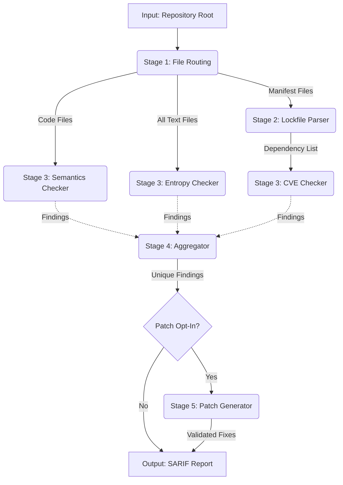
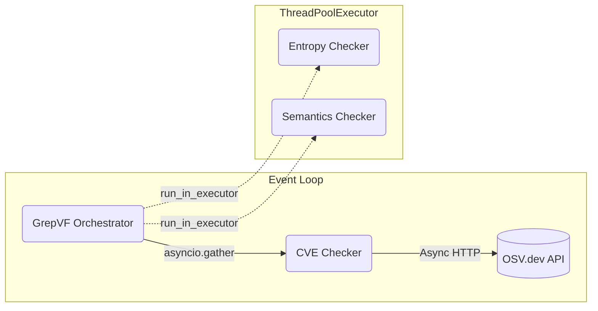
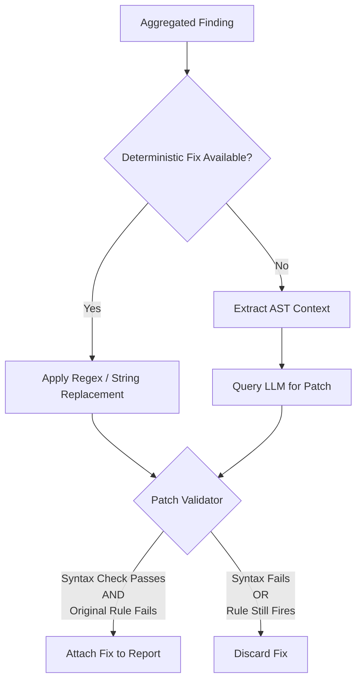
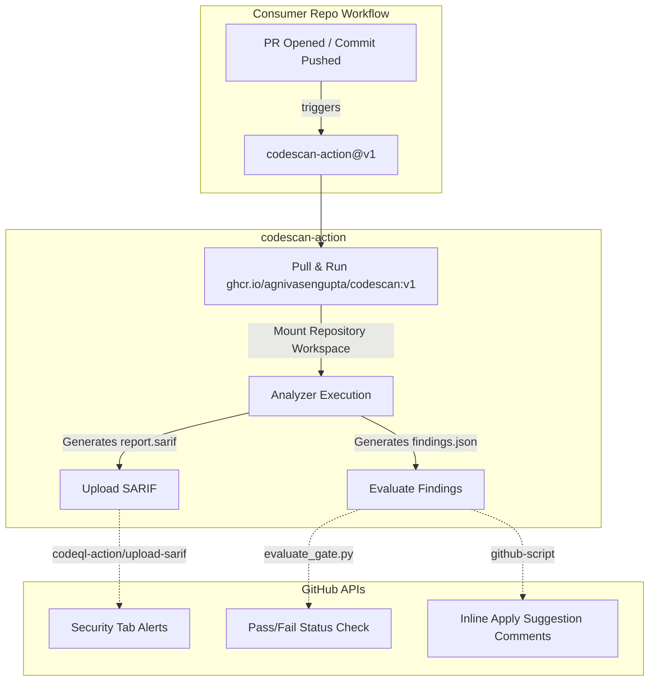

# GrepVF Architecture Map

The GrepVF engine is a static application security testing (SAST) and secret-scanning pipeline designed to be fast, asynchronous, and capable of generating validated autofixes.

## High-Level Pipeline Flow

The engine orchestration is centralized in `engine.core.GrepVF`. The pipeline executes in five distinct, ordered stages.



---

## Stage Breakdown

### 1. File Routing (`engine/filescan`)
Before any heavy scanning begins, `scanner.py` walks the repository and aggressively filters out binary files, oversized blobs, and ignored directories (`.git`, `node_modules`).
It partitions the remaining files into three non-mutually-exclusive queues:
* **Secrets Queue:** Almost all text files, targeting hardcoded credentials.
* **Manifests Queue:** Dependency lockfiles (e.g., `package-lock.json`, `requirements.txt`).
* **Code Queue:** Files with specific extensions (`.py`, `.js`, etc.) or specific names (`Dockerfile`) that require semantic AST analysis.

### 2. Manifest Parse (`engine/codescan/lockfile_parser.py`)
This step is a synchronous prerequisite for the CVE checker. It parses all files in the Manifests queue into a standardized `list[Dependency]` (Package Name, Version, Ecosystem) so the downstream checker doesn't need to implement ecosystem-specific parsers.

### 3. Concurrent Scanners (`engine/codescan`)
The heart of the engine. To maximize throughput, the orchestrator (`core.py`) dispatches these three scanners to run concurrently using `asyncio.gather`.



* **Entropy Checker:** Runs in a thread pool. Uses pure regex matching for known secret formats (AWS, Stripe, GitHub PATs) and Shannon-entropy math to detect unknown high-entropy tokens, utilizing strict false-positive guards (ignoring UUIDs, hex hashes, and placeholder values like "changeme").
* **Semantics Checker:** Runs in a thread pool. Shells out to a `semgrep` subprocess to perform deep, AST-aware taint tracking using custom rules. It also runs Python-native "structural absence" checks (e.g., missing `USER` in Dockerfiles).
* **CVE Checker:** Runs natively on the async event loop. Batches dependencies into groups of 100 and sends them to the OSV.dev `querybatch` API to detect known vulnerable package versions.

### 4. Aggregator (`engine/reports/final.py`)
Because multiple scanners might flag the same issue on the same line (e.g., the Semantics checker flags an ENV var as a misconfiguration, while the Entropy checker flags it as a hardcoded secret), the aggregator normalizes the output.
* **Deduplication:** Collapses identical `(file_path, line)` collisions, keeping the finding with the highest severity.
* **Hazard Scoring:** Elevates the priority of specific findings via a 0-10 score. For example, findings located in "internet-facing" files (e.g., `routes.py`, `views.py`) or findings confirmed via Semgrep taint-mode get a bump in their hazard score, determining the final sort order.

### 5. Patch Generator (`engine/patcher`)
If instantiated with `patch=True`, the engine attempts to generate autofixes for the aggregated findings.



* **Deterministic Fixes:** Safe, hardcoded string replacements for known structural issues (e.g., replacing `verify=False` with `verify=True`).
* **LLM Patcher:** For complex semantic issues, extracts a minimal, token-optimized AST slice of the vulnerable code and prompts an LLM to rewrite it.
* **Patch Validator:** **Critical Safety Gate.** No patch is presented to the user unless it proves it works. The validator writes the patched snippet to a temp file, runs the Python syntax checker, and re-runs the *exact same* Semgrep or Regex rule that triggered the finding. If the code is broken or the rule still fires, the patch is discarded.

## Final Output (`engine/sarif`)
The internal `AggregatedReport` is serialized into **SARIF v2.1.0**. The `writer.py` maps engine attributes (like `Finding.dedup_key()`) to SARIF `partialFingerprints` and `security-severity` properties, allowing the native GitHub Security tab to accurately track vulnerabilities across commits without duplicate noise.

---

## GitHub Actions Integration (`codescan-action`)

The `GrepVF` engine is packaged as a platform-agnostic Docker container (`ghcr.io/agnivasengupta/codescan`). To make it plug-and-play for GitHub users, a separate repository (`codescan-action`) provides the GitHub-specific wrapper (`action.yml`).

This separation of concerns ensures that the core engine knows nothing about GitHub pull requests, while the Action handles all GitHub API interactions.



### How the Action Works:
1. **Container Execution:** The action spins up the `codescan` Docker image, mounts the user's repository into `/workspace`, and runs the engine with `--patch` enabled.
2. **SARIF Upload:** The action uses the official `github/codeql-action/upload-sarif` to push the generated `report.sarif` to the GitHub Security tab.
3. **Gate Evaluation:** A Python script (`evaluate_gate.py`) reads the `findings.json` and compares the unresolved findings against the user's `.codescan.yml` thresholds (e.g., `fail-on: high`).
4. **PR Inline Suggestions:** If triggered on a Pull Request, a Node.js script parses the `findings.json` and uses the GitHub REST API (`createReviewComment`) to post inline comments. It uses the ` ```suggestion ` markdown syntax so that developers can 1-click apply or batch the validated autofixes directly from the GitHub UI.
